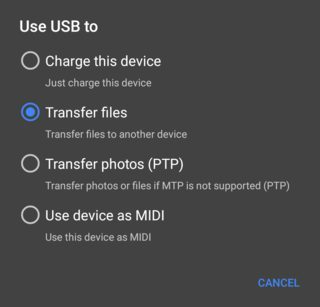
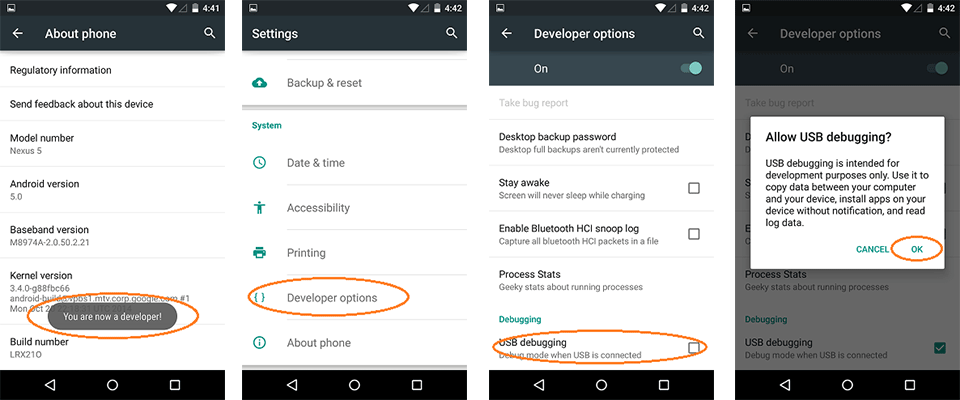
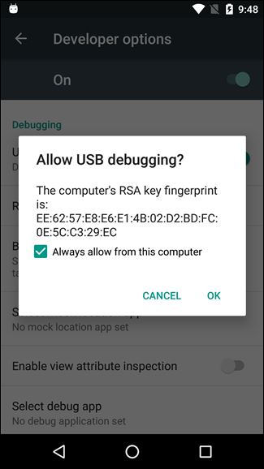

# Reverse-tethering-setup-Windows
One click windows to android internet connection (Opposite of Android USB Tethering)

**How to use:**
[Download this repo zip ~9MB](https://github.com/omkar-tenkale/Reverse-tethering-setup-Windows/archive/master.zip)

Extract the zip file and double click 
**START_ME_gnirehtet-autorun.cmd**

Now connect your android device to your windows pc
Select mode file transfer (not "charge only")

Enable USB debugging
 (search on internet "**How to enable usb debugging in yourdevicehere**<xiaomi/samsung..>  ")
 

 A prompt will appear on your phone
 
Click OK

 App will be automatically installed on phone

A vpn request dialog will appear
Accept it and vpn connection will start which will provide internet connection.

